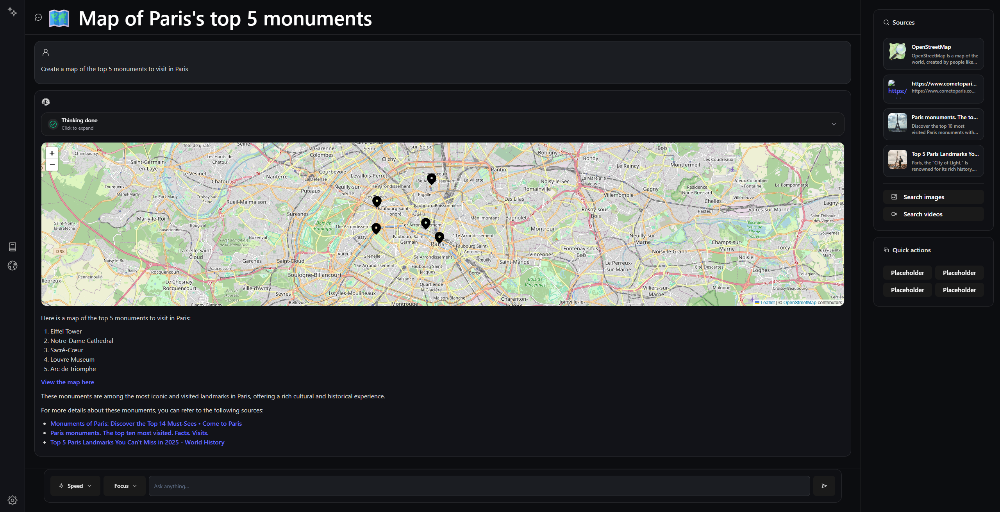

# Ubiquité

> Ubiquité is an open-source Perplexity clone.

This project is inspired by other Perplexity clones such as [Perplexica](https://github.com/ItzCrazyKns/Perplexica) and [Morphic](https://github.com/miurla/morphic).
I made this project because both Perplexica and Morphic were not exactly what I needed.

Compared to those projects, Ubiquité aims to improve on the following points:
- **Multiple LLM providers**: You can choose between multiple LLM providers.
- **Easy model switching**: You can easily switch between models for different use cases while maintaining the ability to connect to multiple AI providers.
- **Unified and complete configuration**: All configuration is done in a single file, with all the options available for each provider and model, this file is editable from the UI.
- **KaTeX support**: Math rendering with KaTeX.
- **Map Tool**: A tool that allows the LLM to generate maps based on user queries.

[](assets/map-tool.png)
*MistralAI • magistral-medium-latest*

# Features

- Multiple LLM providers (OpenAI, Mistral, Groq, Nous, XAI)
- Unified and complete configuration.
- Streaming responses.

# Installation (with Docker)

1. Clone the repository:
   ```bash
   git clone git@github.com:edoigtrd/ubiquite.git
    cd ubiquite
    ```

2. Move the example configuration file:
   ```bash
   mv config.example.toml config.toml
   ```

3. Run the application using Docker Compose:
   ```bash
   docker-compose -p ubiquite up -d
   ```

4. Access the application at `http://localhost:6003`. You can edit the configuration file from the UI (go to the settings).

*Note: Ubiquité needs your location to work properly which don't work on "unsafes" origins, if you are on your own domain you can set it as trusted in chrome using chrome://flags/#unsafely-treat-insecure-origin-as-secure* 

# How to configure

Move `config.example.toml` to `config.toml` and fill in the required fields.

In this file you can configure:

### Providers

In the provider section, you can configure the LLM provider you want to use.
```toml
[provider]
[provider.openai]
type = "openai"
api_key = "your_api_key"
openai_api_base = "https://api.openai.com/v1" # Optional, only if you want to use a different endpoint default is OpenAI's endpoint
```

Supported providers are:
- anthropic
- groq
- mistral
- openai

*Note: the codebase make it easy to add new providers, look into infrastructure/providers.py*

If your provider is available to an openai compatible endpoint (xai, nous ...), you can use the `openai` type and set the `openai_api_base` to your provider's endpoint.

Technically speaking every parameter in one model will be unpacked to the appropriate langchain provider class.

### Models presets

In the models section you can configure model presets.
```toml
[models]
[models.fast]
provider = "groq" # Point towards the provider configured in the provider section, in this case provider.groq
model_name = "moonshotai/kimi-k2-instruct-0905"
```

Standard presets are:
- fast: A fast and cheap model for quick responses.
- smart: A smarter model for more complex queries.
- balanced: A balanced model for general use.
- related: The model used to generate related questions.
- title: The model used to generate titles for saved conversations.
- image_search: The model used to generate image search queries.

### Prompts

Each prompt is configurable
```toml
[prompts]
[prompts.search]
template = """
You are a helpful AI assistant with access to real-time web search, content retrieval, video search capabilities, and the ability to ask clarifying questions.

[REDACTED FOR BREVITY]

Additional information:
{additional_context}
"""
```

> search and related prompt is copied from Morphic; image_search is from Perplexica

Available prompts are:
- search: The main prompt used to answer user queries, note that {additional_context} placeholder will be replaced with a yaml containing user informations such as timezone, location and other preferences.
- related: The prompt used to generate related questions.
- image_search: The prompt used to generate image search queries.
- title: The prompt used to generate titles for saved conversations.

### SearX configuration

In the SearX section you can configure the SearX instance you want to use.
```toml
[searx]
url = "https://your-searx-instance.com"
```
You can find a list of public SearX instances [here](https://searx.space/).

### Database configuration

In the database section you can configure the database you want to use.
```toml
[database]
url = "sqlite:///data/ubiquite.db"
```
I only tested SQLite but any url supported by [SQLModel](https://sqlmodel.tiangolo.com/) should work.

### Focus configuration

Focus mode lets you concentrate on a specific topic by adding custom conditions to SearX search queries.
These conditions can use **any valid SearX syntax**, such as `site:`, `file:`, `intitle:`, or others.

Example:

```toml
[focuses]
[focuses.reddit]
cond = ["site:reddit.com"]
name = "Reddit"
icon = "logos:reddit-icon"
description = "Reddit focus"
llm_description = """
**Reddit focus:**
If the user has activated the Reddit Focus, it is likely because they want to know users' opinions and get responses based on real experiences from online discussions.
"""
```
* **cond** — List of conditions to append to the search query.

  * Multiple conditions are joined with the **OR** operator by default.
  * If you need a different logic, you can group them manually, e.g.:

    ```toml
    cond = ["site:example.com AND file:pdf"]
    ```
  * You can use any SearX-compatible flags like `filetype:`, `inurl:`, `intitle:`, etc.
  * You can also leave this list **empty** if your focus only provides additional LLM context (e.g. a behavioral mode or reasoning focus).
* **name** — Display name of the focus (UI label).
* **icon** — Iconify icon name. [icônes collection](https://icones.netlify.app/collection/all)
* **description** — Shown in the UI.
* **llm_description** — Description injected into the system prompt when this focus is active.

# Map Tool

The map tool (my personnal favorite feature) allows the LLM to answer geolocation related questions by generating a GeoJSON object that is then rendered as an interactive map.
The map tool uses the Nominatim API for geocoding, you can configure the Nominatim URL in the configuration file.

# Architecture

Ubiquité is composed of two main parts:
- The backend: A FastAPI server that handles the LLM requests, search requests and database.
- The frontend: A React app that handles the user interface.

The database is a SQLite database managed by SQLModel.
All the LLM requests are handled by LangChain.

# Contributing

Contributions are welcome!  
If you'd like to add features or improve the project, please fork the repo and submit a pull request.

# Roadmap

- [ ] Image search
- [ ] Discovery page
- [ ] Better settings page (i think we can't do better actually :D)